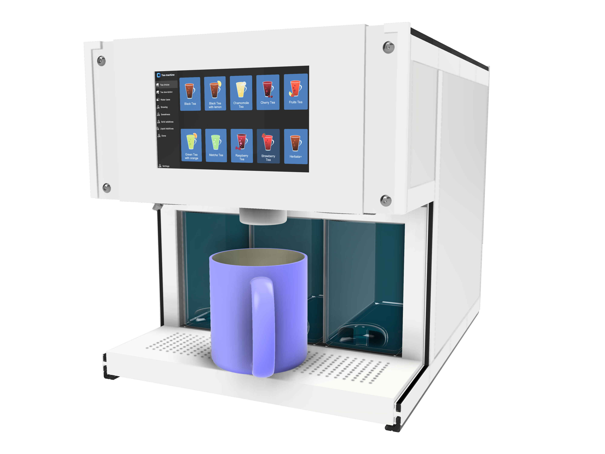
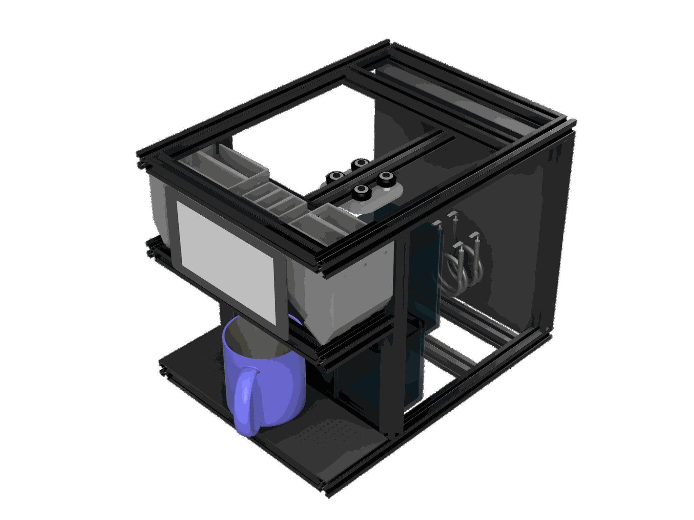
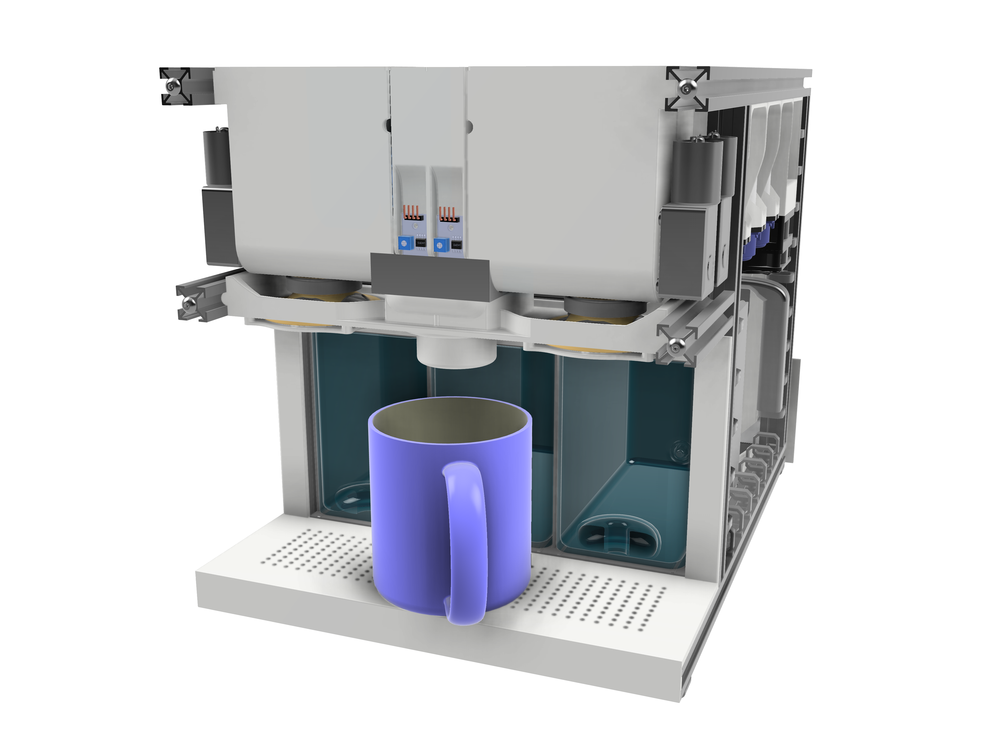
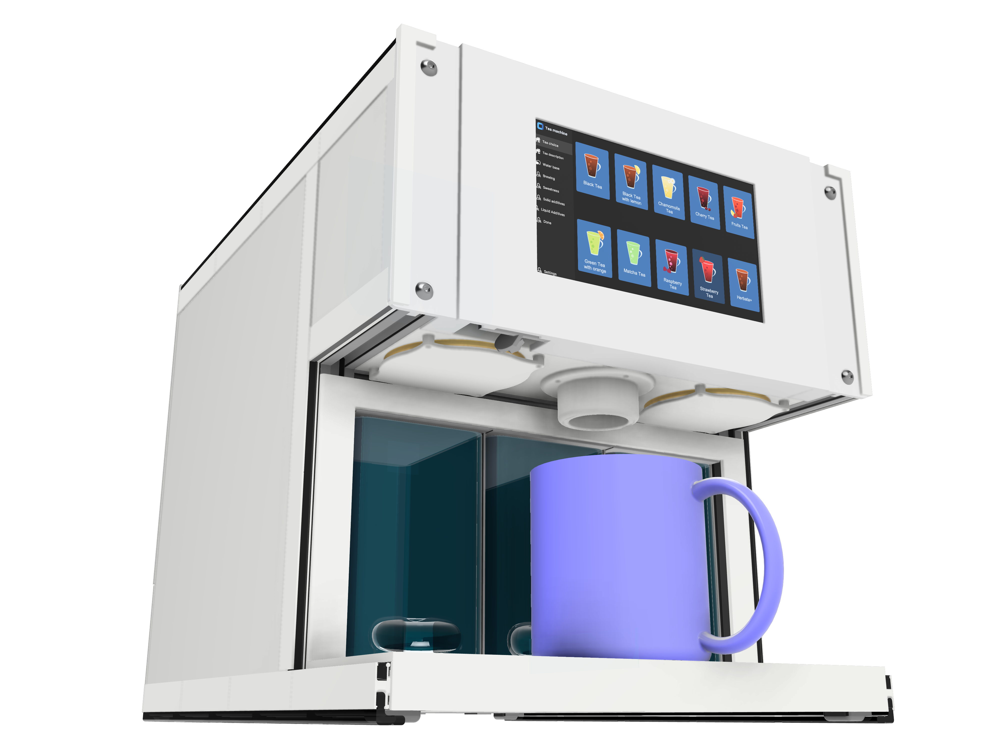
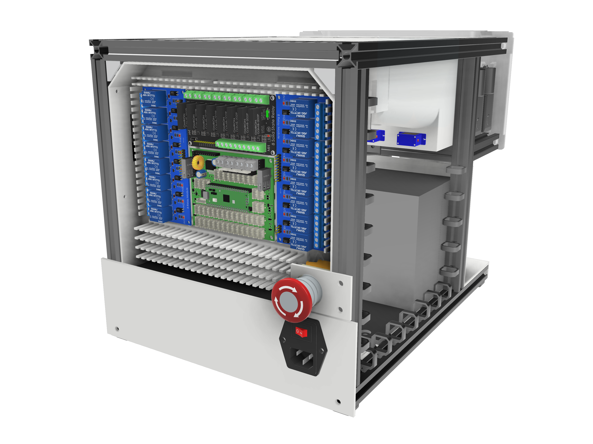
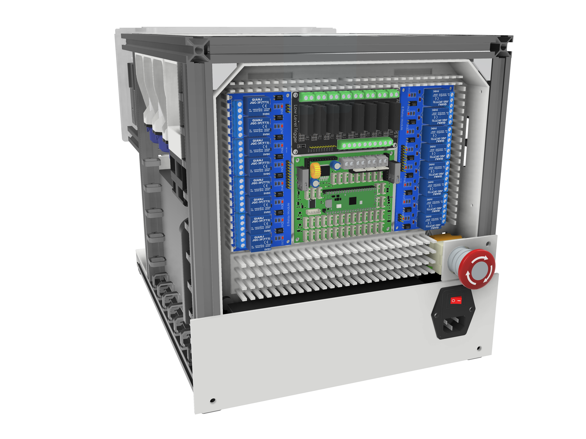
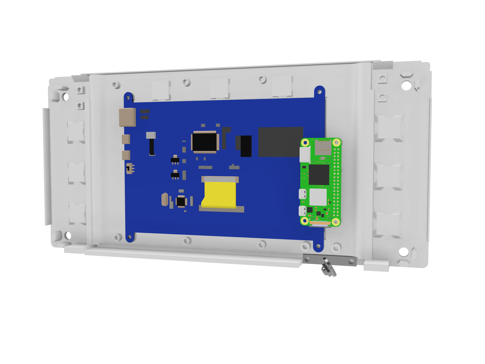
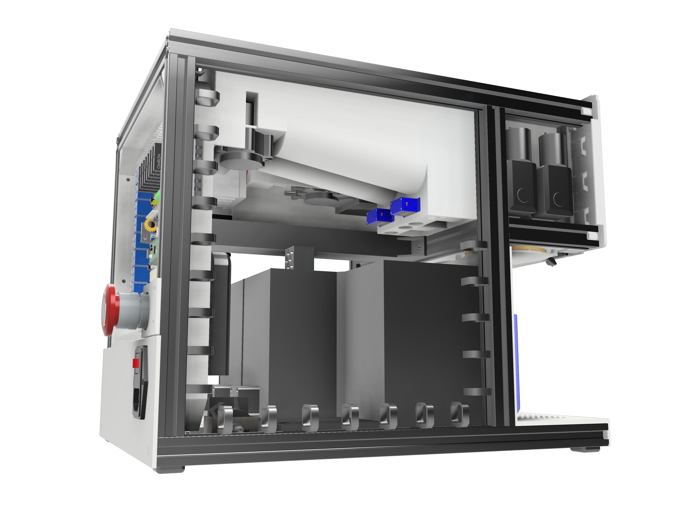
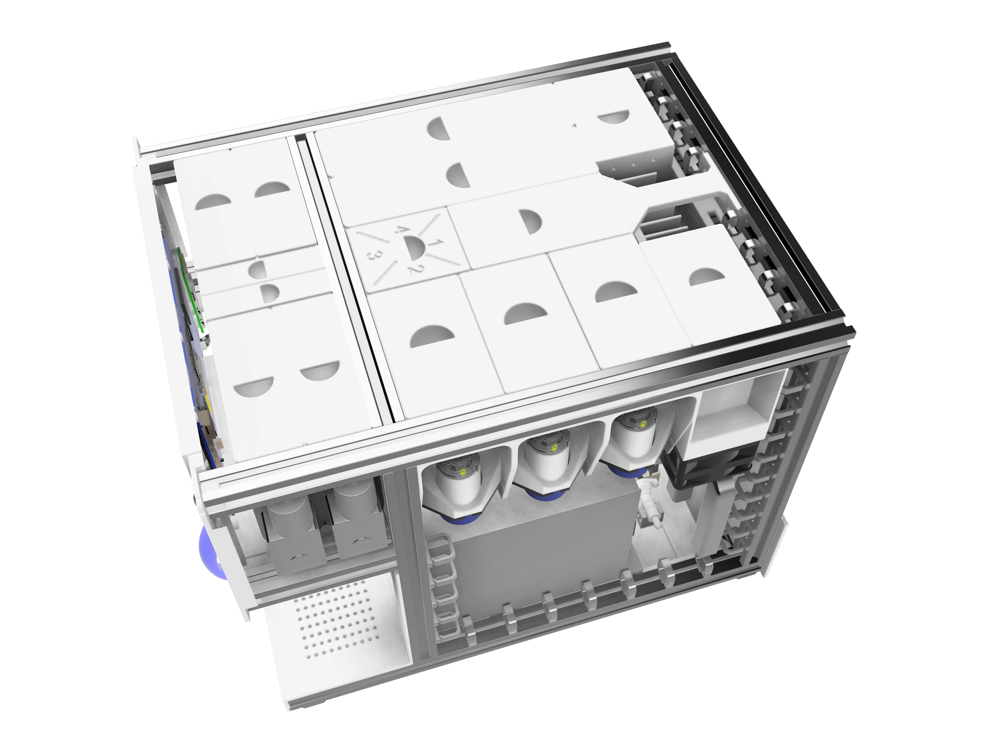
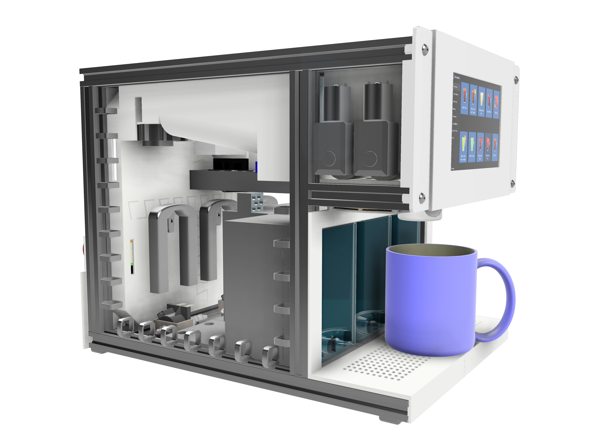

# teaMachineMechanical

- 

## Project Overview
This repository contains the mechanical design files, images, and parts for the Tea Machine project. The Tea Machine is designed to efficiently brew tea with customizable options and includes components for liquid dispensing, heating, and user interaction.
- 

## Directory Details

### `assembly/`
Contains the complete tea machine assembly in Fusion 360 and STEP formats.

### `parts/`
Includes individual parts designed in Fusion 360 and STEP formats.

### `images/`
Renders and visuals of the tea machine

### Renders
- 
- 
- 
- 
- 
- 
- 
- 
